Mini Data Analysis Milestone 1
================

# Welcome to your (maybe) first-ever data analysis project\!

And hopefully the first of many. Let’s get started:

1.  Install the [`datateachr`](https://github.com/UBC-MDS/datateachr)
    package by typing the following into your **R terminal**:

<!-- end list -->

    install.packages("devtools")
    devtools::install_github("UBC-MDS/datateachr")

2.  Load the packages below.

<!-- end list -->

``` r
library(datateachr)
library(tidyverse)
```

    ## ── Attaching packages ─────────────────────────────────────── tidyverse 1.3.1 ──

    ## ✓ ggplot2 3.3.5     ✓ purrr   0.3.4
    ## ✓ tibble  3.1.4     ✓ dplyr   1.0.7
    ## ✓ tidyr   1.1.3     ✓ stringr 1.4.0
    ## ✓ readr   2.0.1     ✓ forcats 0.5.1

    ## ── Conflicts ────────────────────────────────────────── tidyverse_conflicts() ──
    ## x dplyr::filter() masks stats::filter()
    ## x dplyr::lag()    masks stats::lag()

3.  Make a repository in the <https://github.com/stat545ubc-2021>
    Organization. You will be working with this repository for the
    entire data analysis project. You can either make it public, or make
    it private and add the TA’s and Vincenzo as collaborators.

4.  When you go to submit, submit a URL to your repository to canvas.

# Instructions

More details regarding the instructions and points allocated to each
task can be found below. Briefly,

  - Each milestone is worth 30 points. The number of points allocated to
    each task will be annotated within each deliverable. Tasks that are
    more challenging will often be allocated more points.

  - 10 points will be allocated to the reproducibility, cleanliness, and
    coherence of the analysis. While the three milestones will be
    submitted as independent deliverables, the analysis itself is a
    continuum - think of it as 3 chapters to a story. Each chapter, or
    in this case, portion of your analysis, should be easily followed
    through by someone unfamiliar with the content.
    [Here](https://swcarpentry.github.io/r-novice-inflammation/06-best-practices-R/)
    is a good resource for what constitutes “good code”. Learning good
    coding practices early in your career will save you hassle later
    on\!

# Learning Objectives

By the end of this milestone, you should:

  - Become familiar with your dataset of choosing
  - Think of 4 questions that you would like to answer with your data
  - Generate a reproducible and clear report using R Markdown

# Task 1: Choose your favorite dataset (10 points)

The `datateachr` package by Hayley Boyce and Jordan Bourak currently
composed of 7 semi-tidy datasets for educational purposes. Here is a
brief description of each dataset:

  - *apt\_buildings*: Acquired courtesy of The City of Toronto’s Open
    Data Portal. It currently has 3455 rows and 37 columns.

  - *building\_permits*: Acquired courtesy of The City of Vancouver’s
    Open Data Portal. It currently has 20680 rows and 14 columns.

  - *cancer\_sample*: Acquired courtesy of UCI Machine Learning
    Repository. It currently has 569 rows and 32 columns.

  - *flow\_sample*: Acquired courtesy of The Government of Canada’s
    Historical Hydrometric Database. It currently has 218 rows and 7
    columns.

  - *parking\_meters*: Acquired courtesy of The City of Vancouver’s Open
    Data Portal. It currently has 10032 rows and 22 columns.

  - *steam\_games*: Acquired courtesy of Kaggle. It currently has 40833
    rows and 21 columns.

  - *vancouver\_trees*: Acquired courtesy of The City of Vancouver’s
    Open Data Portal. It currently has 146611 rows and 20 columns.

**Things to keep in mind**

  - We hope that this project will serve as practice for carrying our
    your own *independent* data analysis. Remember to comment your code,
    be explicit about what you are doing, and write notes in this
    markdown document when you feel that context is required. As you
    advance in the project, prompts and hints to do this will be
    diminished - it’ll be up to you\!

  - Before choosing a dataset, you should always keep in mind **your
    goal**, or in other ways, *what you wish to achieve with this data*.
    This mini data-analysis project focuses on *data wrangling*,
    *tidying*, and *visualization*. In short, it’s a way for you to get
    your feet wet with exploring data on your own.

And that is exactly the first thing that you will do\!

1.1 Out of the 7 datasets available in the `datateachr` package, choose
**4** that appeal to you based on their description. Write your choices
below:

**Note**: We encourage you to use the ones in the `datateachr` package,
but if you have a dataset that you’d really like to use, you can include
it here. But, please check with a member of the teaching team to see
whether the dataset is of appropriate complexity. Also, include a
**brief** description of the dataset here to help the teaching team
understand your data.

1: *cancer\_sample* \#\# Description *This dataset include parameters
related to cancer diagnosis.We can probably estimate the diagnosis type
based on these parameters*

2: *apt\_buildings*  
\#\# Description *This dataset include information about condition,
facilities and built-year of the apartment buildings. It could help us
understand how the facilities and conditions changes over the years*

3: *flow\_sample*  
\#\# Description *This dataset include flow, flow type and certain month
and day for the flow. It could help us understand how the flow changes
over the time*

4: *steam\_games*  
\#\# Description *This dataset include critical information about steam
games including its developer, language, genre, acheivements etc, which
could give us a brief overview of the steam games on the market*

1.2 One way to narrowing down your selection is to *explore* the
datasets. Use your knowledge of dplyr to find out at least *3*
attributes about each of these datasets (an attribute is something such
as number of rows, variables, class type…). The goal here is to have an
idea of *what the data looks like*.

*Hint:* This is one of those times when you should think about the
cleanliness of your analysis. I added a single code chunk for you, but
do you want to use more than one? Would you like to write more comments
outside of the code chunk?

``` r
### EXPLORE HERE ###

cancer_sample
```

    ## # A tibble: 569 × 32
    ##          ID diagnosis radius_mean texture_mean perimeter_mean area_mean
    ##       <dbl> <chr>           <dbl>        <dbl>          <dbl>     <dbl>
    ##  1   842302 M                18.0         10.4          123.      1001 
    ##  2   842517 M                20.6         17.8          133.      1326 
    ##  3 84300903 M                19.7         21.2          130       1203 
    ##  4 84348301 M                11.4         20.4           77.6      386.
    ##  5 84358402 M                20.3         14.3          135.      1297 
    ##  6   843786 M                12.4         15.7           82.6      477.
    ##  7   844359 M                18.2         20.0          120.      1040 
    ##  8 84458202 M                13.7         20.8           90.2      578.
    ##  9   844981 M                13           21.8           87.5      520.
    ## 10 84501001 M                12.5         24.0           84.0      476.
    ## # … with 559 more rows, and 26 more variables: smoothness_mean <dbl>,
    ## #   compactness_mean <dbl>, concavity_mean <dbl>, concave_points_mean <dbl>,
    ## #   symmetry_mean <dbl>, fractal_dimension_mean <dbl>, radius_se <dbl>,
    ## #   texture_se <dbl>, perimeter_se <dbl>, area_se <dbl>, smoothness_se <dbl>,
    ## #   compactness_se <dbl>, concavity_se <dbl>, concave_points_se <dbl>,
    ## #   symmetry_se <dbl>, fractal_dimension_se <dbl>, radius_worst <dbl>,
    ## #   texture_worst <dbl>, perimeter_worst <dbl>, area_worst <dbl>, …

``` r
#have a overview of cancer_sample datasets#
glimpse(cancer_sample)
```

    ## Rows: 569
    ## Columns: 32
    ## $ ID                      <dbl> 842302, 842517, 84300903, 84348301, 84358402, …
    ## $ diagnosis               <chr> "M", "M", "M", "M", "M", "M", "M", "M", "M", "…
    ## $ radius_mean             <dbl> 17.990, 20.570, 19.690, 11.420, 20.290, 12.450…
    ## $ texture_mean            <dbl> 10.38, 17.77, 21.25, 20.38, 14.34, 15.70, 19.9…
    ## $ perimeter_mean          <dbl> 122.80, 132.90, 130.00, 77.58, 135.10, 82.57, …
    ## $ area_mean               <dbl> 1001.0, 1326.0, 1203.0, 386.1, 1297.0, 477.1, …
    ## $ smoothness_mean         <dbl> 0.11840, 0.08474, 0.10960, 0.14250, 0.10030, 0…
    ## $ compactness_mean        <dbl> 0.27760, 0.07864, 0.15990, 0.28390, 0.13280, 0…
    ## $ concavity_mean          <dbl> 0.30010, 0.08690, 0.19740, 0.24140, 0.19800, 0…
    ## $ concave_points_mean     <dbl> 0.14710, 0.07017, 0.12790, 0.10520, 0.10430, 0…
    ## $ symmetry_mean           <dbl> 0.2419, 0.1812, 0.2069, 0.2597, 0.1809, 0.2087…
    ## $ fractal_dimension_mean  <dbl> 0.07871, 0.05667, 0.05999, 0.09744, 0.05883, 0…
    ## $ radius_se               <dbl> 1.0950, 0.5435, 0.7456, 0.4956, 0.7572, 0.3345…
    ## $ texture_se              <dbl> 0.9053, 0.7339, 0.7869, 1.1560, 0.7813, 0.8902…
    ## $ perimeter_se            <dbl> 8.589, 3.398, 4.585, 3.445, 5.438, 2.217, 3.18…
    ## $ area_se                 <dbl> 153.40, 74.08, 94.03, 27.23, 94.44, 27.19, 53.…
    ## $ smoothness_se           <dbl> 0.006399, 0.005225, 0.006150, 0.009110, 0.0114…
    ## $ compactness_se          <dbl> 0.049040, 0.013080, 0.040060, 0.074580, 0.0246…
    ## $ concavity_se            <dbl> 0.05373, 0.01860, 0.03832, 0.05661, 0.05688, 0…
    ## $ concave_points_se       <dbl> 0.015870, 0.013400, 0.020580, 0.018670, 0.0188…
    ## $ symmetry_se             <dbl> 0.03003, 0.01389, 0.02250, 0.05963, 0.01756, 0…
    ## $ fractal_dimension_se    <dbl> 0.006193, 0.003532, 0.004571, 0.009208, 0.0051…
    ## $ radius_worst            <dbl> 25.38, 24.99, 23.57, 14.91, 22.54, 15.47, 22.8…
    ## $ texture_worst           <dbl> 17.33, 23.41, 25.53, 26.50, 16.67, 23.75, 27.6…
    ## $ perimeter_worst         <dbl> 184.60, 158.80, 152.50, 98.87, 152.20, 103.40,…
    ## $ area_worst              <dbl> 2019.0, 1956.0, 1709.0, 567.7, 1575.0, 741.6, …
    ## $ smoothness_worst        <dbl> 0.1622, 0.1238, 0.1444, 0.2098, 0.1374, 0.1791…
    ## $ compactness_worst       <dbl> 0.6656, 0.1866, 0.4245, 0.8663, 0.2050, 0.5249…
    ## $ concavity_worst         <dbl> 0.71190, 0.24160, 0.45040, 0.68690, 0.40000, 0…
    ## $ concave_points_worst    <dbl> 0.26540, 0.18600, 0.24300, 0.25750, 0.16250, 0…
    ## $ symmetry_worst          <dbl> 0.4601, 0.2750, 0.3613, 0.6638, 0.2364, 0.3985…
    ## $ fractal_dimension_worst <dbl> 0.11890, 0.08902, 0.08758, 0.17300, 0.07678, 0…

``` r
#figure out the diagnosis type of cancer#
cancer_sample$diagnosis
```

    ##   [1] "M" "M" "M" "M" "M" "M" "M" "M" "M" "M" "M" "M" "M" "M" "M" "M" "M" "M"
    ##  [19] "M" "B" "B" "B" "M" "M" "M" "M" "M" "M" "M" "M" "M" "M" "M" "M" "M" "M"
    ##  [37] "M" "B" "M" "M" "M" "M" "M" "M" "M" "M" "B" "M" "B" "B" "B" "B" "B" "M"
    ##  [55] "M" "B" "M" "M" "B" "B" "B" "B" "M" "B" "M" "M" "B" "B" "B" "B" "M" "B"
    ##  [73] "M" "M" "B" "M" "B" "M" "M" "B" "B" "B" "M" "M" "B" "M" "M" "M" "B" "B"
    ##  [91] "B" "M" "B" "B" "M" "M" "B" "B" "B" "M" "M" "B" "B" "B" "B" "M" "B" "B"
    ## [109] "M" "B" "B" "B" "B" "B" "B" "B" "B" "M" "M" "M" "B" "M" "M" "B" "B" "B"
    ## [127] "M" "M" "B" "M" "B" "M" "M" "B" "M" "M" "B" "B" "M" "B" "B" "M" "B" "B"
    ## [145] "B" "B" "M" "B" "B" "B" "B" "B" "B" "B" "B" "B" "M" "B" "B" "B" "B" "M"
    ## [163] "M" "B" "M" "B" "B" "M" "M" "B" "B" "M" "M" "B" "B" "B" "B" "M" "B" "B"
    ## [181] "M" "M" "M" "B" "M" "B" "M" "B" "B" "B" "M" "B" "B" "M" "M" "B" "M" "M"
    ## [199] "M" "M" "B" "M" "M" "M" "B" "M" "B" "M" "B" "B" "M" "B" "M" "M" "M" "M"
    ## [217] "B" "B" "M" "M" "B" "B" "B" "M" "B" "B" "B" "B" "B" "M" "M" "B" "B" "M"
    ## [235] "B" "B" "M" "M" "B" "M" "B" "B" "B" "B" "M" "B" "B" "B" "B" "B" "M" "B"
    ## [253] "M" "M" "M" "M" "M" "M" "M" "M" "M" "M" "M" "M" "M" "M" "B" "B" "B" "B"
    ## [271] "B" "B" "M" "B" "M" "B" "B" "M" "B" "B" "M" "B" "M" "M" "B" "B" "B" "B"
    ## [289] "B" "B" "B" "B" "B" "B" "B" "B" "B" "M" "B" "B" "M" "B" "M" "B" "B" "B"
    ## [307] "B" "B" "B" "B" "B" "B" "B" "B" "B" "B" "B" "M" "B" "B" "B" "M" "B" "M"
    ## [325] "B" "B" "B" "B" "M" "M" "M" "B" "B" "B" "B" "M" "B" "M" "B" "M" "B" "B"
    ## [343] "B" "M" "B" "B" "B" "B" "B" "B" "B" "M" "M" "M" "B" "B" "B" "B" "B" "B"
    ## [361] "B" "B" "B" "B" "B" "M" "M" "B" "M" "M" "M" "B" "M" "M" "B" "B" "B" "B"
    ## [379] "B" "M" "B" "B" "B" "B" "B" "M" "B" "B" "B" "M" "B" "B" "M" "M" "B" "B"
    ## [397] "B" "B" "B" "B" "M" "B" "B" "B" "B" "B" "B" "B" "M" "B" "B" "B" "B" "B"
    ## [415] "M" "B" "B" "M" "B" "B" "B" "B" "B" "B" "B" "B" "B" "B" "B" "B" "M" "B"
    ## [433] "M" "M" "B" "M" "B" "B" "B" "B" "B" "M" "B" "B" "M" "B" "M" "B" "B" "M"
    ## [451] "B" "M" "B" "B" "B" "B" "B" "B" "B" "B" "M" "M" "B" "B" "B" "B" "B" "B"
    ## [469] "M" "B" "B" "B" "B" "B" "B" "B" "B" "B" "B" "M" "B" "B" "B" "B" "B" "B"
    ## [487] "B" "M" "B" "M" "B" "B" "M" "B" "B" "B" "B" "B" "M" "M" "B" "M" "B" "M"
    ## [505] "B" "B" "B" "B" "B" "M" "B" "B" "M" "B" "M" "B" "M" "M" "B" "B" "B" "M"
    ## [523] "B" "B" "B" "B" "B" "B" "B" "B" "B" "B" "B" "M" "B" "M" "M" "B" "B" "B"
    ## [541] "B" "B" "B" "B" "B" "B" "B" "B" "B" "B" "B" "B" "B" "B" "B" "B" "B" "B"
    ## [559] "B" "B" "B" "B" "M" "M" "M" "M" "M" "M" "B"

``` r
#see if there's any missing value in this dataset#
cancer_sample[!complete.cases(cancer_sample),]
```

    ## # A tibble: 0 × 32
    ## # … with 32 variables: ID <dbl>, diagnosis <chr>, radius_mean <dbl>,
    ## #   texture_mean <dbl>, perimeter_mean <dbl>, area_mean <dbl>,
    ## #   smoothness_mean <dbl>, compactness_mean <dbl>, concavity_mean <dbl>,
    ## #   concave_points_mean <dbl>, symmetry_mean <dbl>,
    ## #   fractal_dimension_mean <dbl>, radius_se <dbl>, texture_se <dbl>,
    ## #   perimeter_se <dbl>, area_se <dbl>, smoothness_se <dbl>,
    ## #   compactness_se <dbl>, concavity_se <dbl>, concave_points_se <dbl>, …

``` r
#get a summary results for this datasets#
summary(cancer_sample)
```

    ##        ID             diagnosis          radius_mean      texture_mean  
    ##  Min.   :     8670   Length:569         Min.   : 6.981   Min.   : 9.71  
    ##  1st Qu.:   869218   Class :character   1st Qu.:11.700   1st Qu.:16.17  
    ##  Median :   906024   Mode  :character   Median :13.370   Median :18.84  
    ##  Mean   : 30371831                      Mean   :14.127   Mean   :19.29  
    ##  3rd Qu.:  8813129                      3rd Qu.:15.780   3rd Qu.:21.80  
    ##  Max.   :911320502                      Max.   :28.110   Max.   :39.28  
    ##  perimeter_mean     area_mean      smoothness_mean   compactness_mean 
    ##  Min.   : 43.79   Min.   : 143.5   Min.   :0.05263   Min.   :0.01938  
    ##  1st Qu.: 75.17   1st Qu.: 420.3   1st Qu.:0.08637   1st Qu.:0.06492  
    ##  Median : 86.24   Median : 551.1   Median :0.09587   Median :0.09263  
    ##  Mean   : 91.97   Mean   : 654.9   Mean   :0.09636   Mean   :0.10434  
    ##  3rd Qu.:104.10   3rd Qu.: 782.7   3rd Qu.:0.10530   3rd Qu.:0.13040  
    ##  Max.   :188.50   Max.   :2501.0   Max.   :0.16340   Max.   :0.34540  
    ##  concavity_mean    concave_points_mean symmetry_mean    fractal_dimension_mean
    ##  Min.   :0.00000   Min.   :0.00000     Min.   :0.1060   Min.   :0.04996       
    ##  1st Qu.:0.02956   1st Qu.:0.02031     1st Qu.:0.1619   1st Qu.:0.05770       
    ##  Median :0.06154   Median :0.03350     Median :0.1792   Median :0.06154       
    ##  Mean   :0.08880   Mean   :0.04892     Mean   :0.1812   Mean   :0.06280       
    ##  3rd Qu.:0.13070   3rd Qu.:0.07400     3rd Qu.:0.1957   3rd Qu.:0.06612       
    ##  Max.   :0.42680   Max.   :0.20120     Max.   :0.3040   Max.   :0.09744       
    ##    radius_se        texture_se      perimeter_se       area_se       
    ##  Min.   :0.1115   Min.   :0.3602   Min.   : 0.757   Min.   :  6.802  
    ##  1st Qu.:0.2324   1st Qu.:0.8339   1st Qu.: 1.606   1st Qu.: 17.850  
    ##  Median :0.3242   Median :1.1080   Median : 2.287   Median : 24.530  
    ##  Mean   :0.4052   Mean   :1.2169   Mean   : 2.866   Mean   : 40.337  
    ##  3rd Qu.:0.4789   3rd Qu.:1.4740   3rd Qu.: 3.357   3rd Qu.: 45.190  
    ##  Max.   :2.8730   Max.   :4.8850   Max.   :21.980   Max.   :542.200  
    ##  smoothness_se      compactness_se      concavity_se     concave_points_se 
    ##  Min.   :0.001713   Min.   :0.002252   Min.   :0.00000   Min.   :0.000000  
    ##  1st Qu.:0.005169   1st Qu.:0.013080   1st Qu.:0.01509   1st Qu.:0.007638  
    ##  Median :0.006380   Median :0.020450   Median :0.02589   Median :0.010930  
    ##  Mean   :0.007041   Mean   :0.025478   Mean   :0.03189   Mean   :0.011796  
    ##  3rd Qu.:0.008146   3rd Qu.:0.032450   3rd Qu.:0.04205   3rd Qu.:0.014710  
    ##  Max.   :0.031130   Max.   :0.135400   Max.   :0.39600   Max.   :0.052790  
    ##   symmetry_se       fractal_dimension_se  radius_worst   texture_worst  
    ##  Min.   :0.007882   Min.   :0.0008948    Min.   : 7.93   Min.   :12.02  
    ##  1st Qu.:0.015160   1st Qu.:0.0022480    1st Qu.:13.01   1st Qu.:21.08  
    ##  Median :0.018730   Median :0.0031870    Median :14.97   Median :25.41  
    ##  Mean   :0.020542   Mean   :0.0037949    Mean   :16.27   Mean   :25.68  
    ##  3rd Qu.:0.023480   3rd Qu.:0.0045580    3rd Qu.:18.79   3rd Qu.:29.72  
    ##  Max.   :0.078950   Max.   :0.0298400    Max.   :36.04   Max.   :49.54  
    ##  perimeter_worst    area_worst     smoothness_worst  compactness_worst
    ##  Min.   : 50.41   Min.   : 185.2   Min.   :0.07117   Min.   :0.02729  
    ##  1st Qu.: 84.11   1st Qu.: 515.3   1st Qu.:0.11660   1st Qu.:0.14720  
    ##  Median : 97.66   Median : 686.5   Median :0.13130   Median :0.21190  
    ##  Mean   :107.26   Mean   : 880.6   Mean   :0.13237   Mean   :0.25427  
    ##  3rd Qu.:125.40   3rd Qu.:1084.0   3rd Qu.:0.14600   3rd Qu.:0.33910  
    ##  Max.   :251.20   Max.   :4254.0   Max.   :0.22260   Max.   :1.05800  
    ##  concavity_worst  concave_points_worst symmetry_worst   fractal_dimension_worst
    ##  Min.   :0.0000   Min.   :0.00000      Min.   :0.1565   Min.   :0.05504        
    ##  1st Qu.:0.1145   1st Qu.:0.06493      1st Qu.:0.2504   1st Qu.:0.07146        
    ##  Median :0.2267   Median :0.09993      Median :0.2822   Median :0.08004        
    ##  Mean   :0.2722   Mean   :0.11461      Mean   :0.2901   Mean   :0.08395        
    ##  3rd Qu.:0.3829   3rd Qu.:0.16140      3rd Qu.:0.3179   3rd Qu.:0.09208        
    ##  Max.   :1.2520   Max.   :0.29100      Max.   :0.6638   Max.   :0.20750

### Comment

*There are 569 rows and 32 variables in this datasets. The class type
inclde’dbl’ and ‘char’. Most of the results (beside diagnoisis) is
presented in ‘dbl’ form. The diagnosis type includes “M” and “B” type.
There are no NAs for this datasets*

``` r
apt_buildings
```

    ## # A tibble: 3,455 × 37
    ##       id air_conditioning amenities    balconies barrier_free_acc… bike_parking 
    ##    <dbl> <chr>            <chr>        <chr>     <chr>             <chr>        
    ##  1 10359 NONE             Outdoor rec… YES       YES               0 indoor par…
    ##  2 10360 NONE             Outdoor pool YES       NO                0 indoor par…
    ##  3 10361 NONE             <NA>         YES       NO                Not Available
    ##  4 10362 NONE             <NA>         YES       YES               Not Available
    ##  5 10363 NONE             <NA>         NO        NO                12 indoor pa…
    ##  6 10364 NONE             <NA>         NO        NO                Not Available
    ##  7 10365 NONE             <NA>         NO        YES               Not Available
    ##  8 10366 CENTRAL AIR      Indoor pool… YES       NO                Not Available
    ##  9 10367 NONE             <NA>         YES       YES               0 indoor par…
    ## 10 10368 NONE             Indoor recr… YES       YES               Not Available
    ## # … with 3,445 more rows, and 31 more variables: exterior_fire_escape <chr>,
    ## #   fire_alarm <chr>, garbage_chutes <chr>, heating_type <chr>, intercom <chr>,
    ## #   laundry_room <chr>, locker_or_storage_room <chr>, no_of_elevators <dbl>,
    ## #   parking_type <chr>, pets_allowed <chr>, prop_management_company_name <chr>,
    ## #   property_type <chr>, rsn <dbl>, separate_gas_meters <chr>,
    ## #   separate_hydro_meters <chr>, separate_water_meters <chr>,
    ## #   site_address <chr>, sprinkler_system <chr>, visitor_parking <chr>, …

``` r
#get a overview of this datasets#
glimpse(apt_buildings)
```

    ## Rows: 3,455
    ## Columns: 37
    ## $ id                               <dbl> 10359, 10360, 10361, 10362, 10363, 10…
    ## $ air_conditioning                 <chr> "NONE", "NONE", "NONE", "NONE", "NONE…
    ## $ amenities                        <chr> "Outdoor rec facilities", "Outdoor po…
    ## $ balconies                        <chr> "YES", "YES", "YES", "YES", "NO", "NO…
    ## $ barrier_free_accessibilty_entr   <chr> "YES", "NO", "NO", "YES", "NO", "NO",…
    ## $ bike_parking                     <chr> "0 indoor parking spots and 10 outdoo…
    ## $ exterior_fire_escape             <chr> "NO", "NO", "NO", "YES", "NO", NA, "N…
    ## $ fire_alarm                       <chr> "YES", "YES", "YES", "YES", "YES", "Y…
    ## $ garbage_chutes                   <chr> "YES", "YES", "NO", "NO", "NO", "NO",…
    ## $ heating_type                     <chr> "HOT WATER", "HOT WATER", "HOT WATER"…
    ## $ intercom                         <chr> "YES", "YES", "YES", "YES", "YES", "Y…
    ## $ laundry_room                     <chr> "YES", "YES", "YES", "YES", "YES", "Y…
    ## $ locker_or_storage_room           <chr> "NO", "YES", "YES", "YES", "NO", "YES…
    ## $ no_of_elevators                  <dbl> 3, 3, 0, 1, 0, 0, 0, 2, 4, 2, 0, 2, 2…
    ## $ parking_type                     <chr> "Underground Garage , Garage accessib…
    ## $ pets_allowed                     <chr> "YES", "YES", "YES", "YES", "YES", "Y…
    ## $ prop_management_company_name     <chr> NA, "SCHICKEDANZ BROS. PROPERTIES", N…
    ## $ property_type                    <chr> "PRIVATE", "PRIVATE", "PRIVATE", "PRI…
    ## $ rsn                              <dbl> 4154812, 4154815, 4155295, 4155309, 4…
    ## $ separate_gas_meters              <chr> "NO", "NO", "NO", "NO", "NO", "NO", "…
    ## $ separate_hydro_meters            <chr> "YES", "YES", "YES", "YES", "YES", "Y…
    ## $ separate_water_meters            <chr> "NO", "NO", "NO", "NO", "NO", "NO", "…
    ## $ site_address                     <chr> "65  FOREST MANOR RD", "70  CLIPPER R…
    ## $ sprinkler_system                 <chr> "YES", "YES", "NO", "YES", "NO", "NO"…
    ## $ visitor_parking                  <chr> "PAID", "FREE", "UNAVAILABLE", "UNAVA…
    ## $ ward                             <chr> "17", "17", "03", "03", "02", "02", "…
    ## $ window_type                      <chr> "DOUBLE PANE", "DOUBLE PANE", "DOUBLE…
    ## $ year_built                       <dbl> 1967, 1970, 1927, 1959, 1943, 1952, 1…
    ## $ year_registered                  <dbl> 2017, 2017, 2017, 2017, 2017, NA, 201…
    ## $ no_of_storeys                    <dbl> 17, 14, 4, 5, 4, 4, 4, 7, 32, 4, 4, 7…
    ## $ emergency_power                  <chr> "NO", "YES", "NO", "NO", "NO", "NO", …
    ## $ `non-smoking_building`           <chr> "YES", "NO", "YES", "YES", "YES", "NO…
    ## $ no_of_units                      <dbl> 218, 206, 34, 42, 25, 34, 14, 105, 57…
    ## $ no_of_accessible_parking_spaces  <dbl> 8, 10, 20, 42, 12, 0, 5, 1, 1, 6, 12,…
    ## $ facilities_available             <chr> "Recycling bins", "Green Bin / Organi…
    ## $ cooling_room                     <chr> "NO", "NO", "NO", "NO", "NO", "NO", "…
    ## $ no_barrier_free_accessible_units <dbl> 2, 0, 0, 42, 0, NA, 14, 0, 0, 1, 25, …

``` r
#get a summary results for this datasets#
summary(apt_buildings)
```

    ##        id        air_conditioning    amenities          balconies        
    ##  Min.   :10359   Length:3455        Length:3455        Length:3455       
    ##  1st Qu.:11222   Class :character   Class :character   Class :character  
    ##  Median :12086   Mode  :character   Mode  :character   Mode  :character  
    ##  Mean   :12086                                                           
    ##  3rd Qu.:12950                                                           
    ##  Max.   :13813                                                           
    ##                                                                          
    ##  barrier_free_accessibilty_entr bike_parking       exterior_fire_escape
    ##  Length:3455                    Length:3455        Length:3455         
    ##  Class :character               Class :character   Class :character    
    ##  Mode  :character               Mode  :character   Mode  :character    
    ##                                                                        
    ##                                                                        
    ##                                                                        
    ##                                                                        
    ##   fire_alarm        garbage_chutes     heating_type         intercom        
    ##  Length:3455        Length:3455        Length:3455        Length:3455       
    ##  Class :character   Class :character   Class :character   Class :character  
    ##  Mode  :character   Mode  :character   Mode  :character   Mode  :character  
    ##                                                                             
    ##                                                                             
    ##                                                                             
    ##                                                                             
    ##  laundry_room       locker_or_storage_room no_of_elevators  parking_type      
    ##  Length:3455        Length:3455            Min.   : 0.000   Length:3455       
    ##  Class :character   Class :character       1st Qu.: 0.000   Class :character  
    ##  Mode  :character   Mode  :character       Median : 1.000   Mode  :character  
    ##                                            Mean   : 1.208                     
    ##                                            3rd Qu.: 2.000                     
    ##                                            Max.   :32.000                     
    ##                                            NA's   :5                          
    ##  pets_allowed       prop_management_company_name property_type     
    ##  Length:3455        Length:3455                  Length:3455       
    ##  Class :character   Class :character             Class :character  
    ##  Mode  :character   Mode  :character             Mode  :character  
    ##                                                                    
    ##                                                                    
    ##                                                                    
    ##                                                                    
    ##       rsn          separate_gas_meters separate_hydro_meters
    ##  Min.   :4152554   Length:3455         Length:3455          
    ##  1st Qu.:4153682   Class :character    Class :character     
    ##  Median :4154598   Mode  :character    Mode  :character     
    ##  Mean   :4167867                                            
    ##  3rd Qu.:4155538                                            
    ##  Max.   :4716349                                            
    ##                                                             
    ##  separate_water_meters site_address       sprinkler_system   visitor_parking   
    ##  Length:3455           Length:3455        Length:3455        Length:3455       
    ##  Class :character      Class :character   Class :character   Class :character  
    ##  Mode  :character      Mode  :character   Mode  :character   Mode  :character  
    ##                                                                                
    ##                                                                                
    ##                                                                                
    ##                                                                                
    ##      ward           window_type          year_built   year_registered
    ##  Length:3455        Length:3455        Min.   :1805   Min.   :2017   
    ##  Class :character   Class :character   1st Qu.:1955   1st Qu.:2017   
    ##  Mode  :character   Mode  :character   Median :1962   Median :2017   
    ##                                        Mean   :1962   Mean   :2017   
    ##                                        3rd Qu.:1970   3rd Qu.:2017   
    ##                                        Max.   :2019   Max.   :2020   
    ##                                        NA's   :13     NA's   :89     
    ##  no_of_storeys    emergency_power    non-smoking_building  no_of_units     
    ##  Min.   : 0.000   Length:3455        Length:3455          Min.   :   0.00  
    ##  1st Qu.: 3.000   Class :character   Class :character     1st Qu.:  25.00  
    ##  Median : 5.000   Mode  :character   Mode  :character     Median :  52.00  
    ##  Mean   : 7.738                                           Mean   :  91.09  
    ##  3rd Qu.:10.000                                           3rd Qu.: 124.00  
    ##  Max.   :51.000                                           Max.   :4111.00  
    ##                                                                            
    ##  no_of_accessible_parking_spaces facilities_available cooling_room      
    ##  Min.   :  0.000                 Length:3455          Length:3455       
    ##  1st Qu.:  0.000                 Class :character     Class :character  
    ##  Median :  1.000                 Mode  :character     Mode  :character  
    ##  Mean   :  6.559                                                        
    ##  3rd Qu.:  5.000                                                        
    ##  Max.   :340.000                                                        
    ##  NA's   :123                                                            
    ##  no_barrier_free_accessible_units
    ##  Min.   :  0.000                 
    ##  1st Qu.:  0.000                 
    ##  Median :  0.000                 
    ##  Mean   :  9.408                 
    ##  3rd Qu.:  1.000                 
    ##  Max.   :474.000                 
    ##  NA's   :154

``` r
#see if there's any missing value in this dataset#
apt_buildings[!complete.cases(apt_buildings),]
```

    ## # A tibble: 2,923 × 37
    ##       id air_conditioning amenities  balconies barrier_free_acce… bike_parking  
    ##    <dbl> <chr>            <chr>      <chr>     <chr>              <chr>         
    ##  1 10359 NONE             Outdoor r… YES       YES                0 indoor park…
    ##  2 10361 NONE             <NA>       YES       NO                 Not Available 
    ##  3 10362 NONE             <NA>       YES       YES                Not Available 
    ##  4 10363 NONE             <NA>       NO        NO                 12 indoor par…
    ##  5 10364 NONE             <NA>       NO        NO                 Not Available 
    ##  6 10365 NONE             <NA>       NO        YES                Not Available 
    ##  7 10367 NONE             <NA>       YES       YES                0 indoor park…
    ##  8 10368 NONE             Indoor re… YES       YES                Not Available 
    ##  9 10369 NONE             <NA>       NO        YES                Not Available 
    ## 10 10370 NONE             <NA>       YES       NO                 Not Available 
    ## # … with 2,913 more rows, and 31 more variables: exterior_fire_escape <chr>,
    ## #   fire_alarm <chr>, garbage_chutes <chr>, heating_type <chr>, intercom <chr>,
    ## #   laundry_room <chr>, locker_or_storage_room <chr>, no_of_elevators <dbl>,
    ## #   parking_type <chr>, pets_allowed <chr>, prop_management_company_name <chr>,
    ## #   property_type <chr>, rsn <dbl>, separate_gas_meters <chr>,
    ## #   separate_hydro_meters <chr>, separate_water_meters <chr>,
    ## #   site_address <chr>, sprinkler_system <chr>, visitor_parking <chr>, …

``` r
#find the columns with NA values#
colnames(apt_buildings)[!complete.cases(t(apt_buildings))]
```

    ##  [1] "air_conditioning"                 "amenities"                       
    ##  [3] "balconies"                        "barrier_free_accessibilty_entr"  
    ##  [5] "exterior_fire_escape"             "fire_alarm"                      
    ##  [7] "garbage_chutes"                   "heating_type"                    
    ##  [9] "intercom"                         "laundry_room"                    
    ## [11] "locker_or_storage_room"           "no_of_elevators"                 
    ## [13] "parking_type"                     "pets_allowed"                    
    ## [15] "prop_management_company_name"     "separate_gas_meters"             
    ## [17] "separate_hydro_meters"            "separate_water_meters"           
    ## [19] "sprinkler_system"                 "visitor_parking"                 
    ## [21] "window_type"                      "year_built"                      
    ## [23] "year_registered"                  "emergency_power"                 
    ## [25] "non-smoking_building"             "no_of_accessible_parking_spaces" 
    ## [27] "cooling_room"                     "no_barrier_free_accessible_units"

``` r
#find the categories within char variables#

unique(apt_buildings$air_conditioning)  
```

    ## [1] "NONE"             "CENTRAL AIR"      "INDIVIDUAL UNITS" NA

``` r
unique(apt_buildings$facilities_available)
```

    ## [1] "Recycling bins"       "Green Bin / Organics" "Unknown"             
    ## [4] "Not Available"

# Comment

*There are 3455 rows and 37 variables in this datasets. The class type
include ‘Char’and ’dbl’. Most of the results are (besides id,
no\_of\_elevator, rsn, year\_built, year\_registred and no\_of\_unit)
are presented in chr form. There are 2,923 rows with NA values.There are
NA values for 28 variables like amenities, exterior\_fire\_escape. and
no\_barrier\_Free\_accessible\_units*

``` r
flow_sample
```

    ## # A tibble: 218 × 7
    ##    station_id  year extreme_type month   day  flow sym  
    ##    <chr>      <dbl> <chr>        <dbl> <dbl> <dbl> <chr>
    ##  1 05BB001     1909 maximum          7     7   314 <NA> 
    ##  2 05BB001     1910 maximum          6    12   230 <NA> 
    ##  3 05BB001     1911 maximum          6    14   264 <NA> 
    ##  4 05BB001     1912 maximum          8    25   174 <NA> 
    ##  5 05BB001     1913 maximum          6    11   232 <NA> 
    ##  6 05BB001     1914 maximum          6    18   214 <NA> 
    ##  7 05BB001     1915 maximum          6    27   236 <NA> 
    ##  8 05BB001     1916 maximum          6    20   309 <NA> 
    ##  9 05BB001     1917 maximum          6    17   174 <NA> 
    ## 10 05BB001     1918 maximum          6    15   345 <NA> 
    ## # … with 208 more rows

``` r
#get a overview of this datasets#
glimpse(flow_sample)
```

    ## Rows: 218
    ## Columns: 7
    ## $ station_id   <chr> "05BB001", "05BB001", "05BB001", "05BB001", "05BB001", "0…
    ## $ year         <dbl> 1909, 1910, 1911, 1912, 1913, 1914, 1915, 1916, 1917, 191…
    ## $ extreme_type <chr> "maximum", "maximum", "maximum", "maximum", "maximum", "m…
    ## $ month        <dbl> 7, 6, 6, 8, 6, 6, 6, 6, 6, 6, 6, 7, 6, 6, 6, 7, 5, 7, 6, …
    ## $ day          <dbl> 7, 12, 14, 25, 11, 18, 27, 20, 17, 15, 22, 3, 9, 5, 14, 5…
    ## $ flow         <dbl> 314, 230, 264, 174, 232, 214, 236, 309, 174, 345, 185, 24…
    ## $ sym          <chr> NA, NA, NA, NA, NA, NA, NA, NA, NA, NA, NA, NA, NA, NA, N…

``` r
#see if there's any missing value in this dataset#
flow_sample[!complete.cases(flow_sample),]
```

    ## # A tibble: 119 × 7
    ##    station_id  year extreme_type month   day  flow sym  
    ##    <chr>      <dbl> <chr>        <dbl> <dbl> <dbl> <chr>
    ##  1 05BB001     1909 maximum          7     7   314 <NA> 
    ##  2 05BB001     1910 maximum          6    12   230 <NA> 
    ##  3 05BB001     1911 maximum          6    14   264 <NA> 
    ##  4 05BB001     1912 maximum          8    25   174 <NA> 
    ##  5 05BB001     1913 maximum          6    11   232 <NA> 
    ##  6 05BB001     1914 maximum          6    18   214 <NA> 
    ##  7 05BB001     1915 maximum          6    27   236 <NA> 
    ##  8 05BB001     1916 maximum          6    20   309 <NA> 
    ##  9 05BB001     1917 maximum          6    17   174 <NA> 
    ## 10 05BB001     1918 maximum          6    15   345 <NA> 
    ## # … with 109 more rows

``` r
#find the columns with NA values#
colnames(flow_sample)[!complete.cases(t(flow_sample))]
```

    ## [1] "month" "day"   "flow"  "sym"

### Comment

*There are 218 rows and 7 variables in this datasets. The class type
include ‘Char’and ’dbl’.Most of the results (beside station id and
extreme types) is presented in ‘dbl’ form. 119 rows out of 218 rows have
missing values. ‘Month’ ,‘day’, ‘flow’ and ‘system’ variables all have
missing values*

``` r
steam_games
```

    ## # A tibble: 40,833 × 21
    ##       id url    types name  desc_snippet recent_reviews all_reviews release_date
    ##    <dbl> <chr>  <chr> <chr> <chr>        <chr>          <chr>       <chr>       
    ##  1     1 https… app   DOOM  Now include… Very Positive… Very Posit… May 12, 2016
    ##  2     2 https… app   PLAY… PLAYERUNKNO… Mixed,(6,214)… Mixed,(836… Dec 21, 2017
    ##  3     3 https… app   BATT… Take comman… Mixed,(166),-… Mostly Pos… Apr 24, 2018
    ##  4     4 https… app   DayZ  The post-so… Mixed,(932),-… Mixed,(167… Dec 13, 2018
    ##  5     5 https… app   EVE … EVE Online … Mixed,(287),-… Mostly Pos… May 6, 2003 
    ##  6     6 https… bund… Gran… Grand Theft… NaN            NaN         NaN         
    ##  7     7 https… app   Devi… The ultimat… Very Positive… Very Posit… Mar 7, 2019 
    ##  8     8 https… app   Huma… Human: Fall… Very Positive… Very Posit… Jul 22, 2016
    ##  9     9 https… app   They… They Are Bi… Very Positive… Very Posit… Dec 12, 2017
    ## 10    10 https… app   Warh… In a world … <NA>           Mixed,(904… May 31, 2019
    ## # … with 40,823 more rows, and 13 more variables: developer <chr>,
    ## #   publisher <chr>, popular_tags <chr>, game_details <chr>, languages <chr>,
    ## #   achievements <dbl>, genre <chr>, game_description <chr>,
    ## #   mature_content <chr>, minimum_requirements <chr>,
    ## #   recommended_requirements <chr>, original_price <dbl>, discount_price <dbl>

``` r
#get a overview of this datasets#
glimpse(steam_games)
```

    ## Rows: 40,833
    ## Columns: 21
    ## $ id                       <dbl> 1, 2, 3, 4, 5, 6, 7, 8, 9, 10, 11, 12, 13, 14…
    ## $ url                      <chr> "https://store.steampowered.com/app/379720/DO…
    ## $ types                    <chr> "app", "app", "app", "app", "app", "bundle", …
    ## $ name                     <chr> "DOOM", "PLAYERUNKNOWN'S BATTLEGROUNDS", "BAT…
    ## $ desc_snippet             <chr> "Now includes all three premium DLC packs (Un…
    ## $ recent_reviews           <chr> "Very Positive,(554),- 89% of the 554 user re…
    ## $ all_reviews              <chr> "Very Positive,(42,550),- 92% of the 42,550 u…
    ## $ release_date             <chr> "May 12, 2016", "Dec 21, 2017", "Apr 24, 2018…
    ## $ developer                <chr> "id Software", "PUBG Corporation", "Harebrain…
    ## $ publisher                <chr> "Bethesda Softworks,Bethesda Softworks", "PUB…
    ## $ popular_tags             <chr> "FPS,Gore,Action,Demons,Shooter,First-Person,…
    ## $ game_details             <chr> "Single-player,Multi-player,Co-op,Steam Achie…
    ## $ languages                <chr> "English,French,Italian,German,Spanish - Spai…
    ## $ achievements             <dbl> 54, 37, 128, NA, NA, NA, 51, 55, 34, 43, 72, …
    ## $ genre                    <chr> "Action", "Action,Adventure,Massively Multipl…
    ## $ game_description         <chr> "About This Game Developed by id software, th…
    ## $ mature_content           <chr> NA, "Mature Content Description  The develope…
    ## $ minimum_requirements     <chr> "Minimum:,OS:,Windows 7/8.1/10 (64-bit versio…
    ## $ recommended_requirements <chr> "Recommended:,OS:,Windows 7/8.1/10 (64-bit ve…
    ## $ original_price           <dbl> 19.99, 29.99, 39.99, 44.99, 0.00, NA, 59.99, …
    ## $ discount_price           <dbl> 14.99, NA, NA, NA, NA, 35.18, 70.42, 17.58, N…

``` r
#see if there's any missing value in this dataset#
steam_games[!complete.cases(steam_games),]
```

    ## # A tibble: 40,752 × 21
    ##       id url    types name  desc_snippet recent_reviews all_reviews release_date
    ##    <dbl> <chr>  <chr> <chr> <chr>        <chr>          <chr>       <chr>       
    ##  1     1 https… app   DOOM  Now include… Very Positive… Very Posit… May 12, 2016
    ##  2     2 https… app   PLAY… PLAYERUNKNO… Mixed,(6,214)… Mixed,(836… Dec 21, 2017
    ##  3     3 https… app   BATT… Take comman… Mixed,(166),-… Mostly Pos… Apr 24, 2018
    ##  4     4 https… app   DayZ  The post-so… Mixed,(932),-… Mixed,(167… Dec 13, 2018
    ##  5     5 https… app   EVE … EVE Online … Mixed,(287),-… Mostly Pos… May 6, 2003 
    ##  6     6 https… bund… Gran… Grand Theft… NaN            NaN         NaN         
    ##  7     8 https… app   Huma… Human: Fall… Very Positive… Very Posit… Jul 22, 2016
    ##  8     9 https… app   They… They Are Bi… Very Positive… Very Posit… Dec 12, 2017
    ##  9    10 https… app   Warh… In a world … <NA>           Mixed,(904… May 31, 2019
    ## 10    11 https… app   For … For The Kin… Very Positive… Very Posit… Apr 19, 2018
    ## # … with 40,742 more rows, and 13 more variables: developer <chr>,
    ## #   publisher <chr>, popular_tags <chr>, game_details <chr>, languages <chr>,
    ## #   achievements <dbl>, genre <chr>, game_description <chr>,
    ## #   mature_content <chr>, minimum_requirements <chr>,
    ## #   recommended_requirements <chr>, original_price <dbl>, discount_price <dbl>

``` r
#find the columns with NA values#
colnames(steam_games)[!complete.cases(t(steam_games))]
```

    ##  [1] "types"                    "name"                    
    ##  [3] "desc_snippet"             "recent_reviews"          
    ##  [5] "all_reviews"              "release_date"            
    ##  [7] "developer"                "publisher"               
    ##  [9] "popular_tags"             "game_details"            
    ## [11] "languages"                "achievements"            
    ## [13] "genre"                    "game_description"        
    ## [15] "mature_content"           "minimum_requirements"    
    ## [17] "recommended_requirements" "original_price"          
    ## [19] "discount_price"

### Comment

*There are 40,833 rows with 21 variables in this datasets. The class
include ‘chr’ and ‘dbl’. 40,752 out of 40833 rows have NA values. 19 out
of 21 variables have missing values. Besides, there are lots of
categories (around hundreds to thousands) in each column*

1.3 Now that you’ve explored the 4 datasets that you were initially most
interested in, let’s narrow it down to 2. What lead you to choose these
2? Briefly explain your choices below, and feel free to include any code
in your explanation. \#\#\# Comment *I would narrow down my selection to
apt\_building and cancer\_sample.Even though steam\_games have much
larger data size compared to the others, there are so many categories
within one variables, and it would be difficult for me to study
association between variables. For flow\_sample, there are limited
variables for analysis, and I could not think of any reasonings to
measure variables like month and day*

1.4 Time for the final decision\! Going back to the beginning, it’s
important to have an *end goal* in mind. For example, if I had chosen
the `titanic` dataset for my project, I might’ve wanted to explore the
relationship between survival and other variables. Try to think of 1
research question that you would want to answer with each dataset. Note
them down below, and make your final choice based on what seems more
interesting to you\! \#\#\# Comment *The main reason for me to chosse
these two datasets is that apt\_building has a lots of missing values. I
would need to clean out those NAs before doing analysis, and if those
rows with NAs are removed, the statistical power of the results
generated from those datasets could be reduced. To sum up,
cancer\_sample would be the most appropriate for my analysis, and I can
do logistic regression analysis with outcome as M/B, and explanatory
variables as numeric values*

# Important note

Read Tasks 2 and 3 *fully* before starting to complete either of them.
Probably also a good point to grab a coffee to get ready for the fun
part\!

This project is semi-guided, but meant to be *independent*. For this
reason, you will complete tasks 2 and 3 below (under the **START HERE**
mark) as if you were writing your own exploratory data analysis report,
and this guidance never existed\! Feel free to add a brief introduction
section to your project, format the document with markdown syntax as you
deem appropriate, and structure the analysis as you deem appropriate.
Remember, marks will be awarded for completion of the 4 tasks, but 10
points of the whole project are allocated to a reproducible and clean
analysis. If you feel lost, you can find a sample data analysis
[here](https://www.kaggle.com/headsortails/tidy-titarnic) to have a
better idea. However, bear in mind that it is **just an example** and
you will not be required to have that level of complexity in your
project.

# Task 2: Exploring your dataset (15 points)

If we rewind and go back to the learning objectives, you’ll see that by
the end of this deliverable, you should have formulated *4* research
questions about your data that you may want to answer during your
project. However, it may be handy to do some more exploration on your
dataset of choice before creating these questions - by looking at the
data, you may get more ideas. **Before you start this task, read all
instructions carefully until you reach START HERE**.

2.1 Complete *4 out of the following 8 exercises* to dive deeper into
your data. All datasets are different and therefore, not all of these
tasks may make sense for your data - which is why you should only answer
*4*. Use *dplyr* and *ggplot*.

1.  Plot the distribution of a numeric variable.

### Explanation

*I would like to use histogram to plot the distribution of radius\_mean,
texture\_mean,smoothness\_mean,compactness\_mean,concavity\_mean,
symmetry\_mean and factural\_dimension\_mean*

*histogram would be appropriate to display distribution and could help
me understand how the variables are spreading out*

``` r
ggplot(cancer_sample, aes(radius_mean)) +
   geom_histogram()
```

    ## `stat_bin()` using `bins = 30`. Pick better value with `binwidth`.

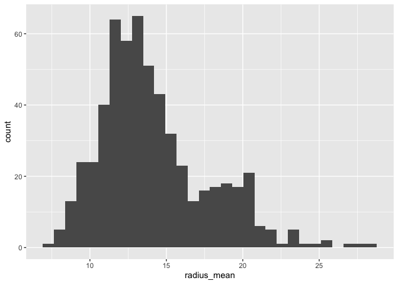<!-- -->

``` r
ggplot(cancer_sample, aes(texture_mean)) +
   geom_histogram()
```

    ## `stat_bin()` using `bins = 30`. Pick better value with `binwidth`.

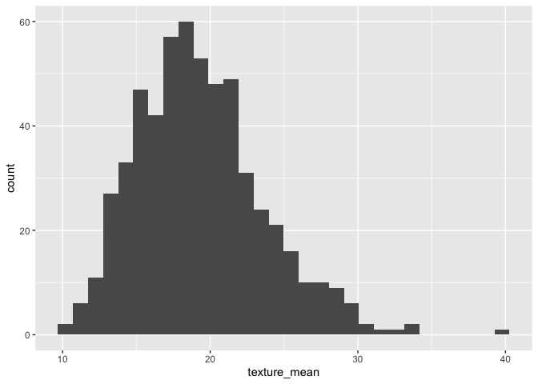<!-- -->

``` r
ggplot(cancer_sample, aes(smoothness_mean)) +
   geom_histogram()
```

    ## `stat_bin()` using `bins = 30`. Pick better value with `binwidth`.

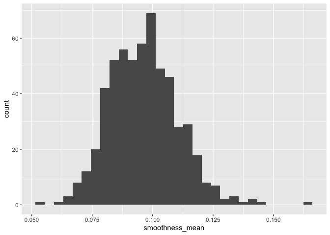<!-- -->

``` r
ggplot(cancer_sample, aes(compactness_mean)) +
   geom_histogram()
```

    ## `stat_bin()` using `bins = 30`. Pick better value with `binwidth`.

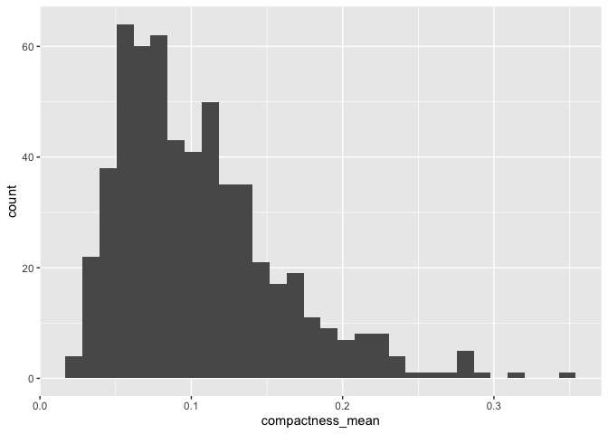<!-- -->

``` r
ggplot(cancer_sample, aes(concavity_mean)) +
   geom_histogram()
```

    ## `stat_bin()` using `bins = 30`. Pick better value with `binwidth`.

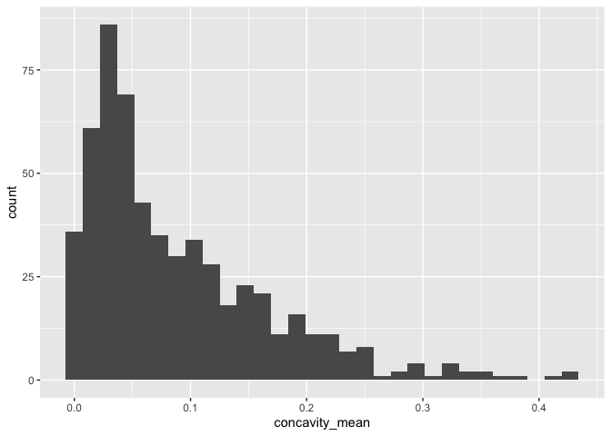<!-- -->

``` r
ggplot(cancer_sample, aes(symmetry_mean)) +
   geom_histogram()
```

    ## `stat_bin()` using `bins = 30`. Pick better value with `binwidth`.

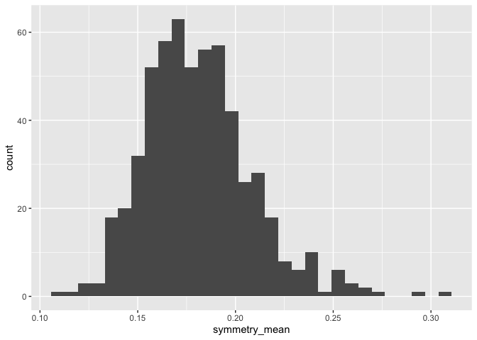<!-- -->

``` r
ggplot(cancer_sample, aes(fractal_dimension_mean)) +
   geom_histogram()
```

    ## `stat_bin()` using `bins = 30`. Pick better value with `binwidth`.

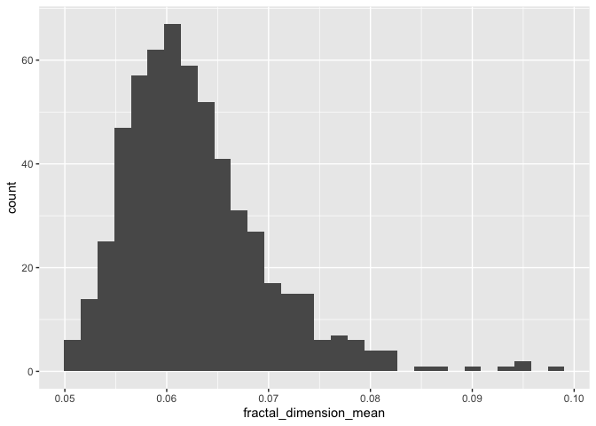<!-- -->
\#\#\# Comments

*1. radius mean has right skewed distribution with peak at 13*

*2. texture mean has bell-shaped distribution with peak at 20*

*3. smothness mean has bell-shaped distribution with peak at 0.1*

*4. compactness mean has right skewed distributition with peak at 0.05*

*5 concavity mean has right skewed distribution with peak at 0.05*

*6 symmetry mean has symmetry distribution with peak at around 0.17*

*7 factural dimension mena has right skewed distribution with peak at
0.06*

2.  Make a new tibble with a subset of your data, with variables and
    observations that you are interested in exploring.

### Explain

*My major study interest would be on parameter means, so I would just
create a variable that contains all the means*

``` r
means<-cancer_sample%>%select(radius_mean:fractal_dimension_mean)
```

*I could also study about SE for the parameters, so I would just create
a variable that contains all the SEs*

``` r
ses<-cancer_sample%>%select(radius_se:fractal_dimension_se)
```

*I could also study about “worst” for the parameters, so I would just
create a variable that contains all the “worsts”*

``` r
worsts<-cancer_sample%>%select(radius_worst:fractal_dimension_worst)
```

3.  Explore the relationship between 2 variables in a plot. \#\#\#
    Explain

*For this part, I would like to know which two variables are highly
correlated with each other. By doing this way, we can eliminate
correlated variables in analysis*

*I assume that radius and area are highly correlated and I would like to
see the relationship between radius\_mean and area\_mean variable*

``` r
ggplot(cancer_sample, aes(radius_mean, area_mean)) +
  geom_point(aes(color = diagnosis),
             size = 3,
             alpha = 0.8) +
  theme_minimal() +
  facet_wrap(~ diagnosis)
```

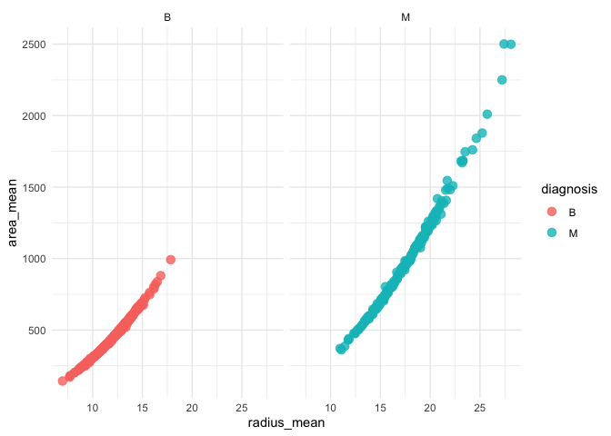<!-- -->
\#\#\# Comment

*It seems that radius\_mean and area\_mean have linear relationship.
When radius mean increases, the area mean also increases. They could be
highly correlated with each other*

4.  Use a boxplot to look at the frequency of different observations
    within a single variable. You can do this for more than one variable
    if you wish\!

### Explain

*With the boxplot, I can visualize how parameter means would differ by
different diagnosis type*

*I would like to see the relationship between texture mean and different
diagnosis types*

``` r
ggplot(cancer_sample, aes(diagnosis, texture_mean)) + 
    geom_boxplot(width = 0.2)
```

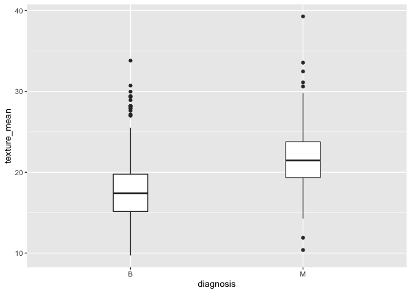<!-- -->
\#\#\# Comment

*Accroding to this graph, patients with diagnosis of ‘M’ have
significantly larger mean texture values compared to those patients with
diagnosis of ‘B’*

*I would like to see the relationship between radius mean and different
diagnosis types*

``` r
ggplot(cancer_sample, aes(diagnosis, radius_mean)) + 
    geom_boxplot(width = 0.2)
```

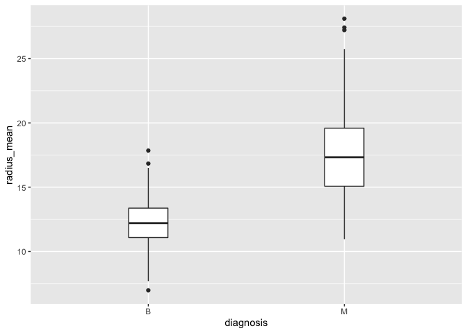<!-- -->

*accroding to this graph, patients with diagnosis of ‘M’ have
significantly larger mean radius compared to those patients with
diagnosis of ‘B’*

### Explain

*I would like to see the relationship between smoothness mean and
different diagnosis types*

``` r
ggplot(cancer_sample, aes(diagnosis, smoothness_mean)) + 
    geom_boxplot(width = 0.2)
```

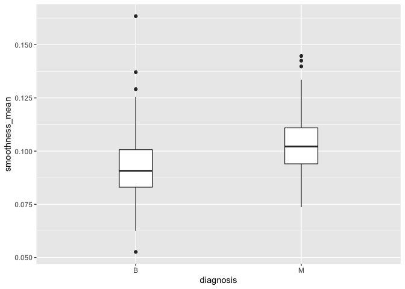<!-- -->

### Comment

*accroding to this graph, patients with diagnosis of ‘M’ have
significantly larger mean smoothness compared to those patients with
diagnosis of ‘B’*

### Explain

*I would like to see the relationship between concavity mean and
different diagnosis types*

``` r
ggplot(cancer_sample, aes(diagnosis, concavity_mean)) + 
    geom_boxplot(width = 0.2)
```

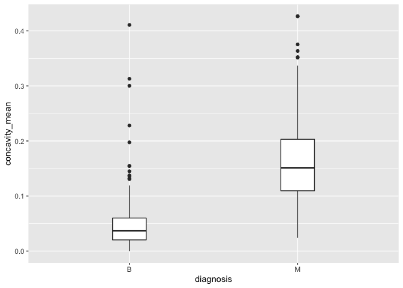<!-- -->
\#\#\# Comment

*Accroding to this graph, patients with diagnosis of ‘M’ have
significantly larger mean concavity compared to those patients with
diagnosis of ‘B’*

### Explain

*I would like to see the relationship between symmetry mean and
different diagnosis types*

``` r
ggplot(cancer_sample, aes(diagnosis, symmetry_mean)) + 
    geom_boxplot(width = 0.2)
```

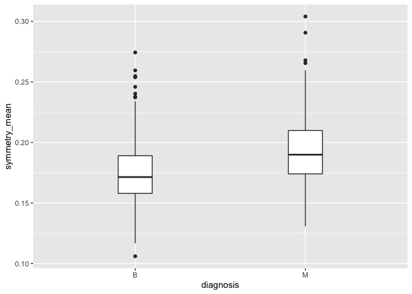<!-- -->

### Comment

*According to this graph, patients with diagnosis of ‘M’ have slightly
larger mean symmetry value compared to those patients with diagnosis of
‘B’*

### Explain

*I would like to see the relationship between fractal\_dimension\_mean
and different diagnosis types*

``` r
ggplot(cancer_sample, aes(diagnosis, fractal_dimension_mean)) + 
    geom_boxplot(width = 0.2)
```

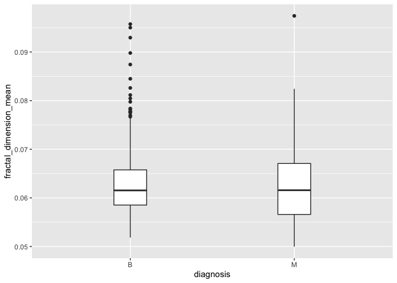<!-- -->
\#\#\# Comment

*according to the graph the factal dimension mean seem to be the same
for the two diagnosis type*

2.2 For each of the 4 exercises that you complete, provide a *brief
explanation* of why you chose that exercise in relation to your data (in
other words, why does it make sense to do that?), and sufficient
comments for a reader to understand your reasoning and code.

# Task 3: Write your research questions (5 points)

So far, you have chosen a dataset and gotten familiar with it through
exploring the data. Now it’s time to figure out 4 research questions
that you would like to answer with your data\! Write the 4 questions and
any additional comments at the end of this deliverable. These questions
are not necessarily set in stone - TAs will review them and give you
feedback; therefore, you may choose to pursue them as they are for the
rest of the project, or make modifications\!

1.  Which parameters are highly correlated to the diagnosis types?

*comments: I can graph distribution plot between each parameter and
diagnosis type so that I could understand which parameter would be the
best to estimate diagnosis types*

2.  Whether the relationship between cancer sample parameters and
    diagnosis type is consistent for mean, SE, and worst

*comments: For this question, I can understand that whether we can just
use the mean, SEs, or worst values to estimate the diagnosis type. For
instance, if radius\_mean, radius\_SE, and radius\_worst all have larger
values for M type compared to B type, we can just use radius\_mean to
estimate diagnosis in the future*

3.  What would be the relationship between means and worsts?

*comments: Would patients with larger mean values also have larger worst
values? With this question, I can understand how mean and worsts are
correlated*

4.  What would be the relationship between SEs and worsts?

*comments: Would patients with larger SE values also have larger worst
values? With this question, I can understand how SEs and worsts are
correlated*

### Attribution

Thanks to Icíar Fernández Boyano for mostly putting this together, and
Vincenzo Coia for launching.
