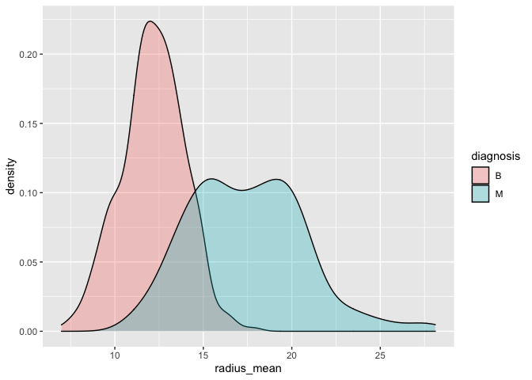
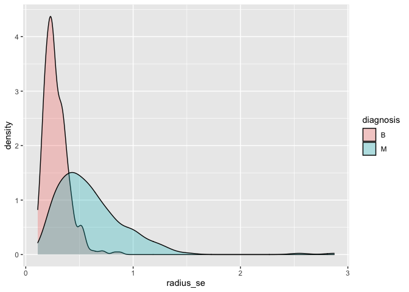
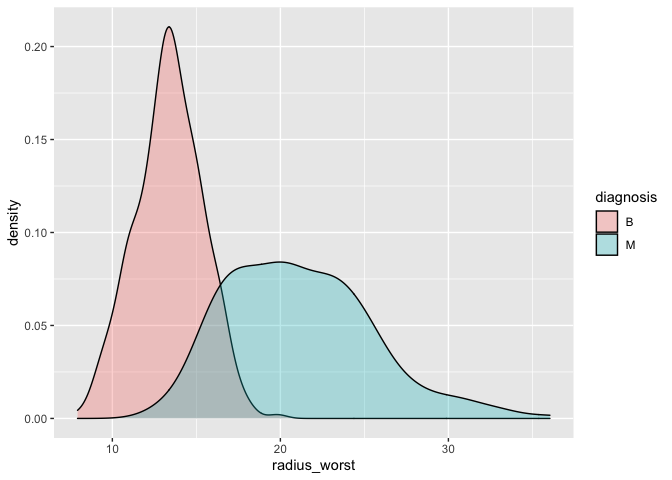
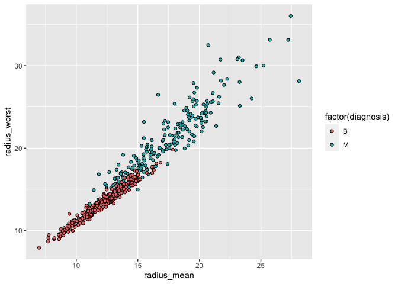
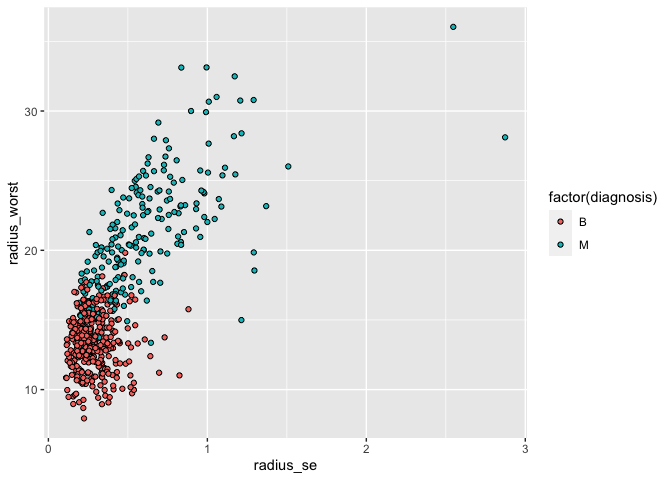

Mini Data Analysis Milestone 2
================

*To complete this milestone, you can either edit [this `.rmd`
file](https://raw.githubusercontent.com/UBC-STAT/stat545.stat.ubc.ca/master/content/mini-project/mini-project-2.Rmd)
directly. Fill in the sections that are commented out with `<!--- start
your work here--->`. When you are done, make sure to knit to an `.md`
file by changing the output in the YAML header to `github_document`,
before submitting a tagged release on canvas.*

# Welcome back to your mini data analysis project\!

This time, we will explore more in depth the concept of *tidy data*, and
hopefully investigate further into your research questions that you
defined in milestone 1.

**NOTE**: The main purpose of the mini data analysis is to integrate
what you learn in class in an analysis. Although each milestone provides
a framework for you to conduct your analysis, it’s possible that you
might find the instructions too rigid for your data set. If this is the
case, you may deviate from the instructions – just make sure you’re
demonstrating a wide range of tools and techniques taught in this class.

Begin by loading your data and the tidyverse package below:

``` r
library(datateachr) # <- might contain the data you picked!
library(tidyverse)
```

# Learning Objectives

By the end of this milestone, you should:

  - Become familiar with manipulating and summarizing your data in
    tibbles using `dplyr` and `tidyr`, with a research question in mind.
  - Understand what *tidy* data is, and how to create it. In milestone
    3, we will explore when this might be useful.
  - Generate a reproducible and clear report using R Markdown.
  - Gain a greater understanding of how to use R to answer research
    questions about your data.

**Things to keep in mind**

  - Remember to document your code, be explicit about what you are
    doing, and write notes in this markdown document when you feel that
    context is required. Create your analysis as if someone else will be
    reading it\! **There will be 2.5 points reserved for
    reproducibility, readability, and repo organization.**

  - Before working on each task, you should always keep in mind the
    specific **research question** that you’re trying to answer.

# Task 1: Process and summarize your data (15 points)

From milestone 1, you should have an idea of the basic structure of your
dataset (e.g. number of rows and columns, class types, etc.). Here, we
will start investigating your data more in-depth using various data
manipulation functions.

### 1.1 (2.5 points)

First, write out the 4 research questions you defined in milestone 1
were. This will guide your work through milestone 2:

<!-------------------------- Start your work below ---------------------------->

1.  *Which parameters are highly correlated to the diagnosis types?*
2.  *Whether the relationship between cancer sample parameters and
    diagnosis type is consistent for mean, SE, and worst*
3.  *What would be the relationship between means and worsts?*
4.  *What would be the relationship between SEs and worsts?*
    <!----------------------------------------------------------------------------->

### 1.2 (10 points)

Now, for each of your four research questions, choose one task from
options 1-4 (summarizing), and one other task from 4-8 (graphing). You
should have 2 tasks done for each research question (8 total). Make sure
it makes sense to do them\! (e.g. don’t use a numerical variables for a
task that needs a categorical variable.). Comment on why each task helps
(or doesn’t\!) answer the corresponding research question.

Ensure that the output of each operation is printed\!

**Summarizing:**

1.  Compute the *range*, *mean*, and *two other summary statistics* of
    **one numerical variable** across the groups of **one categorical
    variable** from your data.
2.  Compute the number of observations for at least one of your
    categorical variables. Do not use the function `table()`\!
3.  Create a categorical variable with 3 or more groups from an existing
    numerical variable. You can use this new variable in the other
    tasks\! *An example: age in years into “child, teen, adult,
    senior”.*
4.  Based on two categorical variables, calculate two summary statistics
    of your choosing.

**Graphing:**

5.  Create a graph out of summarized variables that has at least two
    geom layers.
6.  Create a graph of your choosing, make one of the axes logarithmic,
    and format the axes labels so that they are “pretty” or easier to
    read.
7.  Make a graph where it makes sense to customize the alpha
    transparency.
8.  Create 3 histograms out of summarized variables, with each histogram
    having different sized bins. Pick the “best” one and explain why it
    is the best.

Make sure it’s clear what research question you are doing each operation
for\!

<!------------------------- Start your work below ----------------------------->

1.  *Which parameters are highly correlated to the diagnosis types?*
    \#Regarding this question, we can actually compare the summary
    statistics of one variable across the diagnosis groups. If that
    parameter is highly correlated to the diagnosis types, we would see
    large differences between summary statistics across diagnosis type\#

<!-- end list -->

``` r
#compute the mean of radius_mean across diagnosis type#
cancer_sample %>%
  group_by(diagnosis) %>%
  summarise(mean_radius_mean = mean(radius_mean, na.rm = TRUE))
```

    ## # A tibble: 2 × 2
    ##   diagnosis mean_radius_mean
    ##   <chr>                <dbl>
    ## 1 B                     12.1
    ## 2 M                     17.5

``` r
#compute the range of radius_mean across diagnosis type#
cancer_sample %>%
  group_by(diagnosis) %>%
  summarise(range_radius_mean = range(radius_mean, na.rm = TRUE))
```

    ## # A tibble: 4 × 2
    ## # Groups:   diagnosis [2]
    ##   diagnosis range_radius_mean
    ##   <chr>                 <dbl>
    ## 1 B                      6.98
    ## 2 B                     17.8 
    ## 3 M                     11.0 
    ## 4 M                     28.1

``` r
#compute the median of radius_mean across diagnosis type#
cancer_sample %>%
  group_by(diagnosis) %>%
  summarise(median_radius_mean = median(radius_mean, na.rm = TRUE))
```

    ## # A tibble: 2 × 2
    ##   diagnosis median_radius_mean
    ##   <chr>                  <dbl>
    ## 1 B                       12.2
    ## 2 M                       17.3

``` r
#compute the SD of radius_mean across diagnosis type#
cancer_sample %>%
  group_by(diagnosis) %>%
  summarise(sd_radius_mean = sd(radius_mean, na.rm = TRUE))
```

    ## # A tibble: 2 × 2
    ##   diagnosis sd_radius_mean
    ##   <chr>              <dbl>
    ## 1 B                   1.78
    ## 2 M                   3.20

\#it seems that the summary statistics differ significantly for
radius\_mean, and patients with diagnosis type M tends to have larger
mean, larger range, larger median and larger SD values compared to
patients with diagnosis type B.

\#with density graph, we can also observe how the radius\_mean differ
for diagnosis type \#I use alpha = 0.3 because it allows me visualize
whether there is overlap for radius\_mean for both diagnosis type

``` r
ggplot(cancer_sample, aes(x = radius_mean)) + 
    geom_density(aes(fill = diagnosis),alpha=0.3)#density plot for radius_mean group by diagnosis type
```

<!-- -->
\#even there is overlap of density between radius\_mean, but it is clear
that patients diagnosed with M have relatively higher radius\_mean
compared to those patients diagnosed with B. This indicates that
radius\_mean is related to diagnosis type and could use as a parameter
to estimate diagnosis type.

2.  *Whether the relationship between cancer sample parameters and
    diagnosis type is consistent for mean, SE, and worst*

\#we can keep working on the parameter ‘radius’ and see whether its SD
and worst values also vary significantly across diagnosis type\#

``` r
#let's take a look at the summary statistics of radius_se#
#compute the mean of radius_se across diagnosis type#
cancer_sample %>%
  group_by(diagnosis) %>%
  summarise(mean_radius_se = mean(radius_se, na.rm = TRUE))
```

    ## # A tibble: 2 × 2
    ##   diagnosis mean_radius_se
    ##   <chr>              <dbl>
    ## 1 B                  0.284
    ## 2 M                  0.609

``` r
#compute the range of radius_se across diagnosis type#
cancer_sample %>%
  group_by(diagnosis) %>%
  summarise(range_radius_se = range(radius_se, na.rm = TRUE))
```

    ## # A tibble: 4 × 2
    ## # Groups:   diagnosis [2]
    ##   diagnosis range_radius_se
    ##   <chr>               <dbl>
    ## 1 B                   0.112
    ## 2 B                   0.881
    ## 3 M                   0.194
    ## 4 M                   2.87

``` r
#compute the median of radius_se across diagnosis type#
cancer_sample %>%
  group_by(diagnosis) %>%
  summarise(median_radius_se = median(radius_se, na.rm = TRUE))
```

    ## # A tibble: 2 × 2
    ##   diagnosis median_radius_se
    ##   <chr>                <dbl>
    ## 1 B                    0.258
    ## 2 M                    0.547

``` r
#compute the SD of radius_se across diagnosis type#
cancer_sample %>%
  group_by(diagnosis) %>%
  summarise(sd_radius_se = sd(radius_se, na.rm = TRUE))
```

    ## # A tibble: 2 × 2
    ##   diagnosis sd_radius_se
    ##   <chr>            <dbl>
    ## 1 B                0.113
    ## 2 M                0.345

``` r
#let's take a look at the summary statistics of radius_worst#
#compute the mean of radius_worst across diagnosis type#
cancer_sample %>%
  group_by(diagnosis) %>%
  summarise(mean_radius_worst = mean(radius_worst, na.rm = TRUE))
```

    ## # A tibble: 2 × 2
    ##   diagnosis mean_radius_worst
    ##   <chr>                 <dbl>
    ## 1 B                      13.4
    ## 2 M                      21.1

``` r
#compute the range of radius_worst across diagnosis type#
cancer_sample %>%
  group_by(diagnosis) %>%
  summarise(range_radius_worst = range(radius_worst, na.rm = TRUE))
```

    ## # A tibble: 4 × 2
    ## # Groups:   diagnosis [2]
    ##   diagnosis range_radius_worst
    ##   <chr>                  <dbl>
    ## 1 B                       7.93
    ## 2 B                      19.8 
    ## 3 M                      12.8 
    ## 4 M                      36.0

``` r
#compute the median of radius_worst across diagnosis type#
cancer_sample %>%
  group_by(diagnosis) %>%
  summarise(median_radius_worst = median(radius_worst, na.rm = TRUE))
```

    ## # A tibble: 2 × 2
    ##   diagnosis median_radius_worst
    ##   <chr>                   <dbl>
    ## 1 B                        13.4
    ## 2 M                        20.6

``` r
#compute the SD of radius_worst across diagnosis type#
cancer_sample %>%
  group_by(diagnosis) %>%
  summarise(sd_radius_worst = sd(radius_worst, na.rm = TRUE))
```

    ## # A tibble: 2 × 2
    ##   diagnosis sd_radius_worst
    ##   <chr>               <dbl>
    ## 1 B                    1.98
    ## 2 M                    4.28

\#it seems that the summary statistics differ significantly for both
radius\_se and radius\_worst, and patients with diagnosis type M tends
to have larger mean, larger range, larger median and larger SD values
compared to patients with diagnosis type B. The relationship between
radius and diagnosis type is consistent for mean, SE, and worst.

\#with density graph, we can also observe how the radius\_se and
radius\_worst differ for diagnosis type \#I use alpha = 0.3 because it
allows me visualize whether there is overlap for radius\_Se and
radius\_worst values for both diagnosis type

``` r
ggplot(cancer_sample, aes(x = radius_se)) + 
    geom_density(aes(fill = diagnosis),alpha=0.3)#density plot for radius_se
```

<!-- -->

``` r
ggplot(cancer_sample, aes(x = radius_worst)) + 
    geom_density(aes(fill = diagnosis),alpha=0.3)#density plot for radius_worst
```

<!-- -->
\#even there is overlap of density between both radius\_se and
radius\_worst, but it is clear that patients diagnosed with M have
relatively higher radius\_worst and radius\_se compared to those
patients diagnosed with B. This further verify our conclusion that The
relationship between radius and diagnosis type is consistent for mean,
SE, and worst.

3.  *What would be the relationship between means and worsts?* \#since
    we have computed the summary statistics for radius\_mean, we can
    compute the summary statistics for radius\_mean

<!-- end list -->

``` r
#compute the mean of radius_worst across diagnosis type#
cancer_sample %>%
  group_by(diagnosis) %>%
  summarise(mean_radius_worst = mean(radius_worst, na.rm = TRUE))
```

    ## # A tibble: 2 × 2
    ##   diagnosis mean_radius_worst
    ##   <chr>                 <dbl>
    ## 1 B                      13.4
    ## 2 M                      21.1

``` r
#compute the range of radius_worst across diagnosis type#
cancer_sample %>%
  group_by(diagnosis) %>%
  summarise(range_radius_worst = range(radius_worst, na.rm = TRUE))
```

    ## # A tibble: 4 × 2
    ## # Groups:   diagnosis [2]
    ##   diagnosis range_radius_worst
    ##   <chr>                  <dbl>
    ## 1 B                       7.93
    ## 2 B                      19.8 
    ## 3 M                      12.8 
    ## 4 M                      36.0

``` r
#compute the median of radius_worst across diagnosis type#
cancer_sample %>%
  group_by(diagnosis) %>%
  summarise(median_radius_worst = median(radius_worst, na.rm = TRUE))
```

    ## # A tibble: 2 × 2
    ##   diagnosis median_radius_worst
    ##   <chr>                   <dbl>
    ## 1 B                        13.4
    ## 2 M                        20.6

``` r
#compute the SD of radius_worst across diagnosis type#
cancer_sample %>%
  group_by(diagnosis) %>%
  summarise(sd_radius_worst = sd(radius_worst, na.rm = TRUE))
```

    ## # A tibble: 2 × 2
    ##   diagnosis sd_radius_worst
    ##   <chr>               <dbl>
    ## 1 B                    1.98
    ## 2 M                    4.28

\#While comparing to the summary statitics for radius\_mean, we found
that radius\_worst has slightly higher mean, median and standard
deviation values compared to radius\_mean, and the range for
radius\_worst is also slightly larger in type M compared to the range
for radius\_mean while the range for radius\_worst is almost the same
with the range for radius mean in type B.

\#we can visualize the relationship between radius\_mean and
radius\_worst with the scatterplot

``` r
ggplot(cancer_sample, aes(x = radius_mean, y = radius_worst)) +
       geom_point(aes(fill = factor(diagnosis)), shape = 21)#plot scatterplot between radius_mean and radius_worst
```

<!-- --> \#I
see a strong linear relationship (positive association) between
radius\_worst and radius\_mean for type B, while slighter weaker linear
relationship (positive association) between radius\_worst and
radius\_mean for type M.

4.  *What would be the relationship between SEs and worsts?* \#since we
    have computed the summary statistics for radius\_worst, we can
    compute the summary statistics for radius\_se

<!-- end list -->

``` r
#let's take a look at the summary statistics of radius_se#
#compute the mean of radius_se across diagnosis type#
cancer_sample %>%
  group_by(diagnosis) %>%
  summarise(mean_radius_se = mean(radius_se, na.rm = TRUE))
```

    ## # A tibble: 2 × 2
    ##   diagnosis mean_radius_se
    ##   <chr>              <dbl>
    ## 1 B                  0.284
    ## 2 M                  0.609

``` r
#compute the range of radius_se across diagnosis type#
cancer_sample %>%
  group_by(diagnosis) %>%
  summarise(range_radius_se = range(radius_se, na.rm = TRUE))
```

    ## # A tibble: 4 × 2
    ## # Groups:   diagnosis [2]
    ##   diagnosis range_radius_se
    ##   <chr>               <dbl>
    ## 1 B                   0.112
    ## 2 B                   0.881
    ## 3 M                   0.194
    ## 4 M                   2.87

``` r
#compute the median of radius_se across diagnosis type#
cancer_sample %>%
  group_by(diagnosis) %>%
  summarise(median_radius_se = median(radius_se, na.rm = TRUE))
```

    ## # A tibble: 2 × 2
    ##   diagnosis median_radius_se
    ##   <chr>                <dbl>
    ## 1 B                    0.258
    ## 2 M                    0.547

``` r
#compute the SD of radius_se across diagnosis type#
cancer_sample %>%
  group_by(diagnosis) %>%
  summarise(sd_radius_se = sd(radius_se, na.rm = TRUE))
```

    ## # A tibble: 2 × 2
    ##   diagnosis sd_radius_se
    ##   <chr>            <dbl>
    ## 1 B                0.113
    ## 2 M                0.345

\#we know that patients diagnosed with M would have higher radius\_se
mean, median, standard deviation and range compared to patients
diagnised with B. Since radius\_se and radius\_worst use different
units, we could not compare them directly, but we can assume that linear
relationship (positive association) could be observed for radius\_se and
radius\_worst

\#we can visualize the relationship between radius\_se and radius\_worst
with the scatterplot

``` r
ggplot(cancer_sample, aes(x = radius_se, y = radius_worst)) +
       geom_point(aes(fill = factor(diagnosis)), shape = 21)#plot scatterplot between radius_worst and radius_se
```

<!-- -->
\#However, according to the plot, there doesn’t appear to be a strong
positive association between radius\_worst and radius se. We can even
say that radius\_se and radius\_worst are independent of each other.
<!----------------------------------------------------------------------------->

### 1.3 (2.5 points)

Based on the operations that you’ve completed, how much closer are you
to answering your research questions? Think about what aspects of your
research questions remain unclear. Can your research questions be
refined, now that you’ve investigated your data a bit more? Which
research questions are yielding interesting results?

<!------------------------- Write your answer here ---------------------------->

\#Besides radius, there are also other parameters including texture,
smoothness, compactness, concavity, concave\_points, symmetry, and
fractal\_dimension. The patterns we observed for radius might not be
applied to other parameters. I would need to explore all of the
parameters to draw conclusion for each question. The unclear part
related to my research is that whether the association assesed for each
parameters happen randomly or it has any statistical significance. I
believe this question would require further statistical test. My
research questions are really general, and I would need to assess all
the parameters to answer this questions. But currenly, I would still
keep them because these questions would guide me through the exploration
of those parameters. It is interesting that I thought there might be
positive association between radius\_se and radius\_worst, but when I
plotted the graph, it appears to be no association. It indicates that
scatterplot is really helpful for indicating relationship of two
varaibles.

<!----------------------------------------------------------------------------->

# Task 2: Tidy your data (12.5 points)

In this task, we will do several exercises to reshape our data. The goal
here is to understand how to do this reshaping with the `tidyr` package.

A reminder of the definition of *tidy* data:

  - Each row is an **observation**
  - Each column is a **variable**
  - Each cell is a **value**

*Tidy’ing* data is sometimes necessary because it can simplify
computation. Other times it can be nice to organize data so that it can
be easier to understand when read manually.

### 2.1 (2.5 points)

Based on the definition above, can you identify if your data is tidy or
untidy? Go through all your columns, or if you have \>8 variables, just
pick 8, and explain whether the data is untidy or tidy.

<!--------------------------- Start your work below --------------------------->

The data is untidy. It violates the second principle that “each column
is a **variable**”. Column headers radius\_mean, radius\_se, and
radius\_wort are values, not variable names.These values could be put
under the variable named radius. Additionally, concavity\_mean,
concavity\_se and concavity\_worst are also valies, not variable names,
and these should be put under the variable named concavity.
symmetry\_mean, symmetry\_se, and symmetry\_worst are also values, they
should also be put under the variable named symmetry.

<!----------------------------------------------------------------------------->

### 2.2 (5 points)

Now, if your data is tidy, untidy it\! Then, tidy it back to it’s
original state.

If your data is untidy, then tidy it\! Then, untidy it back to it’s
original state.

Be sure to explain your reasoning for this task. Show us the “before”
and “after”.

<!--------------------------- Start your work below --------------------------->

``` r
#for this task, we will try to convert the untidy data to tidy data#
#to achieve this goal, we will expect to see measures like mean, se, and worst stay under one column, and the values goes under the column with parameters name.

#let's view the "before" version where we have values like radius_mean, radius_se, radius_worst shown as columns
glimpse(cancer_sample)
```

    ## Rows: 569
    ## Columns: 32
    ## $ ID                      <dbl> 842302, 842517, 84300903, 84348301, 84358402, …
    ## $ diagnosis               <chr> "M", "M", "M", "M", "M", "M", "M", "M", "M", "…
    ## $ radius_mean             <dbl> 17.990, 20.570, 19.690, 11.420, 20.290, 12.450…
    ## $ texture_mean            <dbl> 10.38, 17.77, 21.25, 20.38, 14.34, 15.70, 19.9…
    ## $ perimeter_mean          <dbl> 122.80, 132.90, 130.00, 77.58, 135.10, 82.57, …
    ## $ area_mean               <dbl> 1001.0, 1326.0, 1203.0, 386.1, 1297.0, 477.1, …
    ## $ smoothness_mean         <dbl> 0.11840, 0.08474, 0.10960, 0.14250, 0.10030, 0…
    ## $ compactness_mean        <dbl> 0.27760, 0.07864, 0.15990, 0.28390, 0.13280, 0…
    ## $ concavity_mean          <dbl> 0.30010, 0.08690, 0.19740, 0.24140, 0.19800, 0…
    ## $ concave_points_mean     <dbl> 0.14710, 0.07017, 0.12790, 0.10520, 0.10430, 0…
    ## $ symmetry_mean           <dbl> 0.2419, 0.1812, 0.2069, 0.2597, 0.1809, 0.2087…
    ## $ fractal_dimension_mean  <dbl> 0.07871, 0.05667, 0.05999, 0.09744, 0.05883, 0…
    ## $ radius_se               <dbl> 1.0950, 0.5435, 0.7456, 0.4956, 0.7572, 0.3345…
    ## $ texture_se              <dbl> 0.9053, 0.7339, 0.7869, 1.1560, 0.7813, 0.8902…
    ## $ perimeter_se            <dbl> 8.589, 3.398, 4.585, 3.445, 5.438, 2.217, 3.18…
    ## $ area_se                 <dbl> 153.40, 74.08, 94.03, 27.23, 94.44, 27.19, 53.…
    ## $ smoothness_se           <dbl> 0.006399, 0.005225, 0.006150, 0.009110, 0.0114…
    ## $ compactness_se          <dbl> 0.049040, 0.013080, 0.040060, 0.074580, 0.0246…
    ## $ concavity_se            <dbl> 0.05373, 0.01860, 0.03832, 0.05661, 0.05688, 0…
    ## $ concave_points_se       <dbl> 0.015870, 0.013400, 0.020580, 0.018670, 0.0188…
    ## $ symmetry_se             <dbl> 0.03003, 0.01389, 0.02250, 0.05963, 0.01756, 0…
    ## $ fractal_dimension_se    <dbl> 0.006193, 0.003532, 0.004571, 0.009208, 0.0051…
    ## $ radius_worst            <dbl> 25.38, 24.99, 23.57, 14.91, 22.54, 15.47, 22.8…
    ## $ texture_worst           <dbl> 17.33, 23.41, 25.53, 26.50, 16.67, 23.75, 27.6…
    ## $ perimeter_worst         <dbl> 184.60, 158.80, 152.50, 98.87, 152.20, 103.40,…
    ## $ area_worst              <dbl> 2019.0, 1956.0, 1709.0, 567.7, 1575.0, 741.6, …
    ## $ smoothness_worst        <dbl> 0.1622, 0.1238, 0.1444, 0.2098, 0.1374, 0.1791…
    ## $ compactness_worst       <dbl> 0.6656, 0.1866, 0.4245, 0.8663, 0.2050, 0.5249…
    ## $ concavity_worst         <dbl> 0.71190, 0.24160, 0.45040, 0.68690, 0.40000, 0…
    ## $ concave_points_worst    <dbl> 0.26540, 0.18600, 0.24300, 0.25750, 0.16250, 0…
    ## $ symmetry_worst          <dbl> 0.4601, 0.2750, 0.3613, 0.6638, 0.2364, 0.3985…
    ## $ fractal_dimension_worst <dbl> 0.11890, 0.08902, 0.08758, 0.17300, 0.07678, 0…

``` r
#the "after" version will have measures like mean, se, and worst stay under one column, and the values goes under the column with parameters name.
tidy_cancer_sample<-cancer_sample %>% 
  rename(concave.points_mean = concave_points_mean, concave.points_se=concave_points_se,
         concave.points_worst=concave_points_worst, fractal.dimension_se=fractal_dimension_se, fractal.dimension_mean=fractal_dimension_mean, fractal.dimension_worst=fractal_dimension_worst)%>% #rename some variables to format the column names
  pivot_longer(cols      = c(-ID, -diagnosis), 
               names_to  = c(".value", "measure"),
               names_sep = "_")
```

<!----------------------------------------------------------------------------->

### 2.3 (5 points)

Now, you should be more familiar with your data, and also have made
progress in answering your research questions. Based on your interest,
and your analyses, pick 2 of the 4 research questions to continue your
analysis in milestone 3, and explain your decision.

Try to choose a version of your data that you think will be appropriate
to answer these 2 questions in milestone 3. Use between 4 and 8
functions that we’ve covered so far (i.e. by filtering, cleaning,
tidy’ing, dropping irrelvant columns, etc.).

<!--------------------------- Start your work below --------------------------->

``` r
#The questions I am attempting to answer would be 
#1. *Which parameters are highly correlated to the diagnosis types?*
#2. *Whether the relationship between cancer sample parameters and diagnosis type is consistent for mean, SE, and worst*


#To answer this question, I would first tidy my dataset based on the tidy_cancer_sample, and then calculate the mean summary statistics based on diagnosis type and parameter, and see how the measures for each parameter differ for diagnosis types

mean<-tidy_cancer_sample%>%  
  filter(measure == "mean")%>%
  pivot_longer(cols = c(-ID, -diagnosis, -measure), 
               names_to  = "parameter", 
               values_to = "mean_value")%>%
  group_by(parameter, diagnosis)%>%summarise(mean_mean = mean(mean_value, na.rm = TRUE))

#Based on the table, it seems that patients diagnosed with M have higher average values in radius_mean, area_mean, compactness_mean, concave.points_mean, concavity_mean, perimeter_mean,   symmetry_mean, and texture_mean compared to patients diagnosed with B, while their fractal.dimension_mean and smoothness_mean almost stays the same.


se<-tidy_cancer_sample%>%  
  filter(measure == "se")%>%
  pivot_longer(cols = c(-ID, -diagnosis, -measure), 
               names_to  = "parameter", 
               values_to = "se_value")%>%
  group_by(parameter, diagnosis)%>%summarise(se_mean = mean(se_value, na.rm = TRUE))

#Based on the table, it seems that patients diagnosed with M have higher average values in radius_se, area_se, compactness_se, concave.points_se, concavity_se, perimeter_se compared to patients diagnosed with B, while their fractal.dimension_mean, smoothness_mean, symmetry_se, and texture_se almost stays the same.

worst<-tidy_cancer_sample%>%  
  filter(measure == "worst")%>%
  pivot_longer(cols = c(-ID, -diagnosis, -measure), 
               names_to  = "parameter", 
               values_to = "worst_value")%>%
  group_by(parameter, diagnosis)%>%summarise(worst_mean = mean(worst_value, na.rm = TRUE))
  
#Based on the table, it seems that patients diagnosed with M have higher average values in radius_worst, area_worst, compactness_worst, concave.points_worst, concavity_worst, perimeter_worst fractal.dimension_worst, smoothness_worst, symmetry_worst, and texture_worst compared to patients diagnosed with B. 


#Conclusion
#Q1: According to the results, we can conclude that parameters like radius, area, compactness, concave.points, concavity and perimeter could be are highly correlated to diagnosis type, we could see their mean, worst and se measure vary significantly for different diagnosis types. 

#Q2:  For parameters like radius, area, compactness, concave.points, concavity and perimeter, we can see that patients diagnosed with M have higher average in mean, worst and se compared to patients diagnosed with B, indicating consistent relationship. However for parameters like fractal.dimension, smoothness, symmetry, and texture, we might see higher avarage value for people diagnosed with "M" in the worst group but when we look at the se group, the average values are almost the same for both diagnosis types, indicating inconsistent relationship. 
```

<!----------------------------------------------------------------------------->

*When you are done, knit an `md` file. This is what we will mark\! Make
sure to open it and check that everything has knitted correctly before
submitting your tagged release.*

### Attribution

Thanks to Victor Yuan for mostly putting this together.
